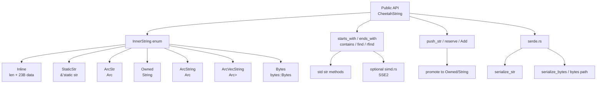
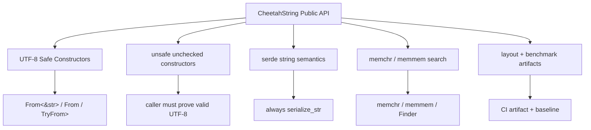
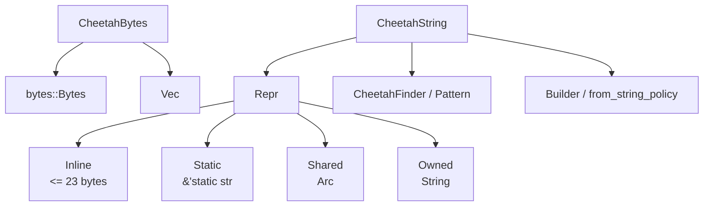
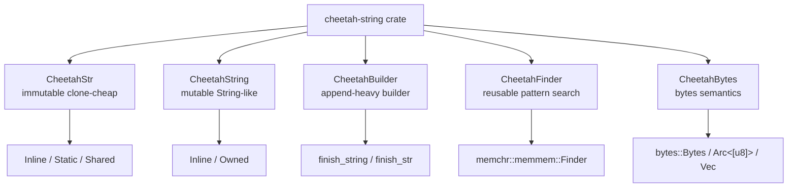

# CheetahString 95+ 架构升级与极致性能优化设计方案

日期：2026-06-19  
项目：[`mxsm/cheetah-string`](https://github.com/mxsm/cheetah-string)  
状态：RFC Ready / 95+ Design  
目标版本建议：`v1.1` 安全修复，`v1.2` 架构收敛，`v2.0` 极致性能实验  
评分目标：`95+ / 100`  
核心原则：**先保证字符串安全不变量，再做可证明的性能优化，最后再引入 unsafe packed representation。**

---

## 0. 文档定位

本文是 `cheetah-string` 的架构升级设计文档，目标不是简单列优化点，而是形成一套可以进入 RFC / ADR / PR 排期的完整方案。

本文覆盖：

```text
1. 当前架构评估
2. 核心风险识别
3. 95+ 设计补强项
4. v1.1 / v1.2 / v2.0 分阶段目标架构
5. API 兼容矩阵
6. UTF-8 安全不变量
7. serde 字符串语义
8. bytes/string 语义分离
9. 内部 Repr 收敛方案
10. 24B packed representation 实验方案
11. unsafe proof checklist
12. layout snapshot 规范
13. benchmark artifact 规范
14. PR 级实施计划
15. 测试、Miri、fuzz、sanitizer、CI gate
16. 性能极致优化路线
17. RocketMQ/Rust 真实 workload benchmark
18. 95+ 验收标准
```

---

## 1. 执行摘要

`cheetah-string` 当前定位是一个轻量、高性能、面向性能敏感场景的 Rust 字符串类型。当前实现已经具备以下方向：

```text
1. 短字符串内联存储：长度 <= 23 bytes 时不分配堆内存。
2. StaticStr：支持 &'static str 零拷贝。
3. Arc 共享：长字符串使用 Arc<str> / Arc<String> 等共享存储降低 clone 成本。
4. 可选 feature：serde / bytes / simd。
5. 默认 std，声明 no_std + alloc 兼容方向。
6. 已有 tests 与 Criterion benches。
```

这使它很适合服务 `rocketmq-rust` 中大量短字符串、重复字符串、名称类字符串场景，例如：

```text
topic
consumer group
producer group
broker name
cluster name
message key
property key
remoting header
route table key
```

但是当前实现还不适合作为“长期稳定基础字符串类型”直接大规模进入核心路径，原因不是方向错，而是几个基础语义需要先硬化：

```text
P0-1：safe API 仍可能通过 From<&[u8]> / From<Vec<u8>> / from_vec 等路径绕过 UTF-8 校验。
P0-2：as_str() / Deref<str> 依赖 unchecked UTF-8，但当前构造路径还不能完全证明合法。
P0-3：serde 行为可能因内部 variant 不同而在 string / bytes 语义之间摇摆。
P0-4：bytes feature 当前不是 optional dependency，feature 语义不完整。
P1-1：InnerString variant 过多，影响对象大小、branch、cache locality 和 API 语义。
P1-2：Bytes / ArcVecString 是字节语义，不应混入字符串核心模型。
P1-3：手写 SIMD 搜索未必稳定优于 memchr/memmem，需要通过 benchmark 决策。
```

### 1.1 95+ 设计结论

本方案推荐分三阶段升级：

```text
v1.1：安全语义修复版
  - 硬化 UTF-8 不变量
  - safe bytes 构造全部改为 TryFrom / try_from_*
  - unchecked 构造全部 unsafe
  - serde 统一 serialize_str / valid UTF-8 deserialize
  - bytes 改成 optional dependency
  - 引入 memchr/memmem 搜索优化
  - 建立 layout snapshot 与 benchmark artifact

v1.2：架构收敛与低风险性能优化版
  - 核心 Repr 收敛为 Inline / Static / Shared / Owned
  - ArcVecString / Bytes 从 CheetahString 核心剥离
  - 引入 CheetahBytes 或 CheetahByteString
  - 优化 push_str / Add / reserve / from_string policy
  - 增加 MQ 真实 workload benchmark

v2.0：极致性能实验版
  - 拆分 CheetahStr / CheetahString / CheetahBuilder / CheetahFinder / CheetahBytes
  - 实验 24B packed representation
  - 通过 unsafe proof、Miri、fuzz、sanitizer、layout、benchmark 后再进入主线
```

### 1.2 最终架构目标

```text
CheetahString 必须永远代表合法 UTF-8。
字节语义必须从字符串核心中剥离。
短字符串必须零分配。
常见 clone/hash/eq/find/push 场景必须稳定快。
性能结论必须来自 before/after artifact，而不是主观判断。
unsafe packed representation 必须先进入 experimental feature，不能直接替换稳定实现。
```

---

## 2. 当前仓库事实与风险依据

### 2.1 Cargo 与 feature 现状

当前 `Cargo.toml` 中：

```toml
[dependencies]
bytes = "1.10.0"
serde = { version = "1.0", optional = true, default-features = false, features = ["alloc"] }

[features]
default = ["std"]
std = []
serde = ["serde/alloc"]
bytes = []
simd = []
```

问题：

```text
1. bytes 是普通依赖，不是 optional dependency。
2. features.bytes = [] 只影响 cfg(feature = "bytes")，不控制依赖是否引入。
3. 如果 README/API 语义认为 bytes 是可选 feature，那么 Cargo feature 需要修正。
```

目标修正：

```toml
[dependencies]
bytes = { version = "1.10", optional = true, default-features = false }
serde = { version = "1.0", optional = true, default-features = false, features = ["alloc"] }
memchr = { version = "2", default-features = false }

[features]
default = ["std"]
std = ["memchr/std"]
serde = ["dep:serde", "serde/alloc"]
bytes = ["dep:bytes"]
simd = []
experimental-packed = []
```

---

### 2.2 当前核心存储模型

当前 `CheetahString` 可以理解为：

```rust
#[derive(Clone)]
#[repr(transparent)]
pub struct CheetahString {
    inner: InnerString,
}
```

当前 `InnerString` 大致包含：

```rust
enum InnerString {
    Inline { len: u8, data: [u8; INLINE_CAPACITY] },
    StaticStr(&'static str),
    ArcStr(Arc<str>),
    Owned(String),
    ArcString(Arc<String>),
    ArcVecString(Arc<Vec<u8>>),
    #[cfg(feature = "bytes")]
    Bytes(bytes::Bytes),
}
```

其中 `INLINE_CAPACITY = 23`。

优点：

```text
1. 短字符串内联。
2. 静态字符串零拷贝。
3. 长字符串可共享。
4. 支持可变 Owned 路径。
5. 支持 bytes 网络生态。
```

问题：

```text
1. variant 过多，match 分支多，类型大小难以控制。
2. ArcVecString / Bytes 是字节语义，会污染字符串不变量。
3. ArcStr / ArcString / Owned 并存，用户无法直观看出 mutation/capacity/clone 语义。
4. from_string 默认转 Arc<str> 可能丢失 String capacity，对后续 push_str/reserve 不友好。
5. #[repr(transparent)] 只说明外层透明包住 InnerString，不代表对象大小等于 String。
```

---

### 2.3 当前 UTF-8 风险

当前实现中存在或曾存在如下路径：

```rust
impl From<&[u8]> for CheetahString
impl From<Vec<u8>> for CheetahString
pub fn from_vec(v: Vec<u8>) -> Self
pub fn from_arc_vec(v: Arc<Vec<u8>>) -> Self
#[cfg(feature = "bytes")]
pub fn from_bytes(b: bytes::Bytes) -> Self
```

同时 `as_str()` 对 Inline / ArcVecString / Bytes 等路径可能使用：

```rust
unsafe { core::str::from_utf8_unchecked(...) }
```

这本身不是问题。问题在于：

```text
unchecked as_str() 只有在所有 safe 构造路径都保证合法 UTF-8 时才成立。
如果 safe API 可以绕过校验，那么 CheetahString 的核心不变量被破坏。
字符串基础库不允许 safe API 制造内部非法 UTF-8。
```

因此，P0 必须修复。

---

## 3. 评分目标与 95+ 设计补强

上一版方案可以达到约 `92 / 100`，原因是方向正确、问题识别准确、PR 路线清晰，但还缺少：

```text
1. 当前版本 layout 实测规范。
2. benchmark artifact 目录与 JSON 输出规范。
3. unsafe packed representation 的 proof checklist。
4. API compatibility matrix。
5. 最小 prototype 验收矩阵。
6. SemVer/breaking change 决策表。
7. 进入主线的硬 gate。
```

本版补齐这些内容后，目标为：

```text
评分：95+ / 100
等级：A / RFC Ready
状态：可以进入开发排期，但性能结论仍需 benchmark artifact 证明。
```

### 3.1 95+ 必须满足的硬标准

```text
1. 所有 safe API 维护 UTF-8 不变量。
2. serde 对外语义固定为 string，不因内部 variant 改变。
3. bytes 语义与 string 语义分离。
4. Cargo feature 与依赖开关一致。
5. layout snapshot 可重复生成并纳入 CI artifact。
6. benchmark before/after artifact 可重复生成。
7. unsafe packed repr 只能在 experimental feature 中实现。
8. packed repr 进入主线前必须通过 unsafe proof、Miri、fuzz、sanitizer、benchmark。
9. 每个 PR 都有测试命令、回滚策略和验收标准。
10. 文档中不宣称未被 benchmark 证明的性能收益。
```

---

## 4. 当前架构图



---

## 5. 目标架构总览

### 5.1 v1.1 目标架构：安全语义修复



v1.1 不要求大改内部 Repr，优先目标是：

```text
1. 不再允许 safe API 创建非法 UTF-8。
2. serde 行为稳定。
3. feature 正确。
4. 搜索优化可通过 benchmark 验证。
5. 建立后续优化的数据基线。
```

---

### 5.2 v1.2 目标架构：Repr 收敛



v1.2 核心目标：

```text
1. 核心字符串模型收敛为 Inline / Static / Shared / Owned。
2. 移除 ArcVecString 作为核心字符串 variant。
3. Bytes 从 CheetahString 核心剥离为 CheetahBytes。
4. String 的容量语义与共享语义明确分离。
5. mutation 快路径完善。
```

建议 v1.2 内部 Repr：

```rust
enum Repr {
    Inline(InlineString),
    Static(&'static str),
    Shared(Arc<str>),
    Owned(String),
}
```

---

### 5.3 v2.0 目标架构：类型职责拆分



v2.0 核心目标：

```text
CheetahStr：不可变、clone-cheap、适合 key/name/topic/group。
CheetahString：可变、String-like、适合构建和 push_str。
CheetahBuilder：多次追加后一次性 compact。
CheetahFinder：复用 needle 的高性能搜索器。
CheetahBytes：字节语义，不承诺 UTF-8。
```

这个拆分可以避免一个类型同时承担：

```text
不可变共享
可变构建
字节零拷贝
serde string
serde bytes
极致 packed layout
```

---

## 6. 核心不变量设计

### 6.1 UTF-8 不变量

```text
Invariant-UTF8-001：任何通过 safe API 创建的 CheetahString 都必须是合法 UTF-8。
Invariant-UTF8-002：as_str() / Deref<Target = str> 可以使用 unchecked，但必须由构造路径证明合法。
Invariant-UTF8-003：任何绕过 UTF-8 校验的构造函数必须是 unsafe。
Invariant-UTF8-004：unsafe unchecked 构造函数必须在文档中写明调用者责任。
Invariant-UTF8-005：serde deserialize bytes 路径必须校验 UTF-8。
Invariant-UTF8-006：CheetahBytes 不承诺 UTF-8，不能 Deref<Target = str>。
```

---

### 6.2 Inline 不变量

```text
Invariant-Inline-001：Inline.len <= INLINE_CAPACITY。
Invariant-Inline-002：Inline.data[..len] 必须是合法 UTF-8。
Invariant-Inline-003：Inline.data[len..] 内容未定义语义，不参与 hash/eq/as_str。
Invariant-Inline-004：Inline clone 是固定上限 memcpy，不分配。
Invariant-Inline-005：Inline push_str 若 total_len <= INLINE_CAPACITY，则仍保持 Inline。
```

---

### 6.3 Static 不变量

```text
Invariant-Static-001：Static 只保存 &'static str。
Invariant-Static-002：Static clone 只复制引用，不分配。
Invariant-Static-003：Static drop 不释放字符串内容。
Invariant-Static-004：Static push_str 必须 promote 到 Owned 或 Inline。
```

---

### 6.4 Shared 不变量

```text
Invariant-Shared-001：Shared 使用 Arc<str>，内容不可变且合法 UTF-8。
Invariant-Shared-002：Shared clone 只增加引用计数。
Invariant-Shared-003：Shared push_str 必须 promote 到 Owned，不能原地修改。
Invariant-Shared-004：Shared into_string 可以在 unique 时尝试复用，否则复制。
```

---

### 6.5 Owned 不变量

```text
Invariant-Owned-001：Owned 使用 String，天然合法 UTF-8。
Invariant-Owned-002：Owned push_str / reserve 应尽量复用 capacity。
Invariant-Owned-003：Owned clone 语义应与 String 一致，除非显式转换为 Shared/CheetahStr。
Invariant-Owned-004：From<String> 不应默认丢失用户传入的 capacity，除非 API 名称明确表示 compact/shared。
```

---

## 7. API 设计

### 7.1 safe 构造 API

推荐 v1.1：

```rust
impl CheetahString {
    pub const fn new() -> Self;
    pub const fn empty() -> Self;

    pub fn from_str(s: &str) -> Self;
    pub fn from_string(s: String) -> Self;
    pub const fn from_static_str(s: &'static str) -> Self;

    pub fn try_from_bytes(bytes: &[u8]) -> Result<Self, Utf8Error>;
    pub fn try_from_vec(vec: Vec<u8>) -> Result<Self, Utf8Error>;

    #[cfg(feature = "bytes")]
    pub fn try_from_bytes_buf(bytes: bytes::Bytes) -> Result<Self, Utf8Error>;
}
```

Trait impl：

```rust
impl From<&str> for CheetahString;
impl From<String> for CheetahString;
impl From<&String> for CheetahString;
impl TryFrom<&[u8]> for CheetahString;
impl TryFrom<Vec<u8>> for CheetahString;

#[cfg(feature = "bytes")]
impl TryFrom<bytes::Bytes> for CheetahString;
```

禁止或 deprecated：

```rust
impl From<&[u8]> for CheetahString;      // remove in next breaking version
impl From<Vec<u8>> for CheetahString;    // remove in next breaking version
impl From<bytes::Bytes> for CheetahString; // remove or change to TryFrom
```

---

### 7.2 unsafe unchecked 构造 API

```rust
impl CheetahString {
    /// # Safety
    ///
    /// Caller must guarantee `bytes` is valid UTF-8 for the entire lifetime
    /// of the returned CheetahString. Violating this contract may cause
    /// undefined behavior when `as_str` or `Deref<str>` is used.
    pub unsafe fn from_utf8_unchecked_bytes(bytes: &[u8]) -> Self;

    /// # Safety
    ///
    /// Caller must guarantee `vec` contains valid UTF-8.
    pub unsafe fn from_utf8_unchecked_vec(vec: Vec<u8>) -> Self;

    #[cfg(feature = "bytes")]
    /// # Safety
    ///
    /// Caller must guarantee the bytes buffer contains valid UTF-8.
    pub unsafe fn from_utf8_unchecked_bytes_buf(bytes: bytes::Bytes) -> Self;
}
```

要求：

```text
1. 所有 unsafe unchecked API 名称必须包含 utf8_unchecked。
2. 所有 unsafe unchecked API 必须有 # Safety 文档。
3. safe from_* 不能偷用 unchecked 绕过校验，除非输入类型已经证明是 str/String。
```

---

### 7.3 FromStringPolicy

当前 `From<String>` 默认转 `Arc<str>` 对 clone 友好，但会丢掉 `String` capacity。建议引入策略 API：

```rust
pub enum FromStringPolicy {
    /// len <= inline -> Inline，否则保留 Owned(String)。
    PreserveOwned,

    /// len <= inline -> Inline，否则转 Shared(Arc<str>)。
    Shared,

    /// len <= inline 且 cap <= inline -> Inline，否则 Owned。
    BuilderPreserve,

    /// len <= inline -> Inline，否则根据启发式选择 Owned/Shared。
    Auto,
}
```

推荐 API：

```rust
impl CheetahString {
    pub fn from_string_owned(s: String) -> Self;
    pub fn from_string_shared(s: String) -> Self;
    pub fn from_string_compact(s: String) -> Self;
    pub fn from_string_with_policy(s: String, policy: FromStringPolicy) -> Self;
}
```

默认建议：

```text
From<String> 默认 PreserveOwned，更符合 Rust String 语义和 capacity 直觉。
from_string_shared 明确用于 clone-cheap 不可变场景。
from_string_compact 明确用于压缩存储场景。
```

---

### 7.4 serde 语义

`CheetahString` 是字符串类型，所以 serde 行为必须与内部存储无关。

推荐：

```rust
impl serde::Serialize for CheetahString {
    fn serialize<S>(&self, serializer: S) -> Result<S::Ok, S::Error>
    where
        S: serde::Serializer,
    {
        serializer.serialize_str(self.as_str())
    }
}
```

Deserialize：

```rust
impl<'de> serde::Deserialize<'de> for CheetahString {
    fn deserialize<D>(deserializer: D) -> Result<Self, D::Error>
    where
        D: serde::Deserializer<'de>,
    {
        deserializer.deserialize_str(CheetahStringVisitor)
    }
}
```

Visitor 要求：

```rust
fn visit_str<E>(self, v: &str) -> Result<Self::Value, E>
where
    E: serde::de::Error,
{
    Ok(CheetahString::from(v))
}

fn visit_string<E>(self, v: String) -> Result<Self::Value, E>
where
    E: serde::de::Error,
{
    Ok(CheetahString::from_string_owned(v))
}

fn visit_bytes<E>(self, v: &[u8]) -> Result<Self::Value, E>
where
    E: serde::de::Error,
{
    let s = core::str::from_utf8(v).map_err(E::custom)?;
    Ok(CheetahString::from(s))
}

fn visit_byte_buf<E>(self, v: Vec<u8>) -> Result<Self::Value, E>
where
    E: serde::de::Error,
{
    CheetahString::try_from_vec(v).map_err(E::custom)
}
```

禁止：

```text
CheetahString 不应因内部 variant 是 Bytes/ArcVecString 而 serialize_bytes。
如果用户需要字节序列化，应使用 CheetahBytes。
```

---

### 7.5 CheetahBytes

```rust
#[cfg(feature = "bytes")]
pub struct CheetahBytes {
    inner: BytesRepr,
}

#[cfg(feature = "bytes")]
enum BytesRepr {
    Inline { len: u8, data: [u8; 23] },
    Shared(bytes::Bytes),
    Owned(Vec<u8>),
}
```

能力：

```rust
impl CheetahBytes {
    pub fn as_bytes(&self) -> &[u8];
    pub fn try_into_string(self) -> Result<CheetahString, Utf8Error>;
    pub unsafe fn into_string_unchecked(self) -> CheetahString;
}
```

设计原则：

```text
CheetahBytes 是字节类型，不实现 Deref<Target = str>。
CheetahString 是字符串类型，不通过 safe API 保存非法 UTF-8。
```

---

### 7.6 搜索 API 与 CheetahFinder

推荐默认搜索：

```rust
impl CheetahString {
    pub fn find(&self, needle: &str) -> Option<usize> {
        memchr::memmem::find(self.as_bytes(), needle.as_bytes())
    }

    pub fn rfind(&self, needle: &str) -> Option<usize> {
        memchr::memmem::rfind(self.as_bytes(), needle.as_bytes())
    }

    pub fn find_byte(&self, byte: u8) -> Option<usize> {
        memchr::memchr(byte, self.as_bytes())
    }
}
```

重复 needle 场景：

```rust
pub struct CheetahFinder<'a> {
    finder: memchr::memmem::Finder<'a>,
}

impl<'a> CheetahFinder<'a> {
    pub fn new(needle: &'a str) -> Self {
        Self {
            finder: memchr::memmem::Finder::new(needle),
        }
    }

    pub fn find_in(&self, haystack: &CheetahString) -> Option<usize> {
        self.finder.find(haystack.as_bytes())
    }
}
```

使用场景：

```text
1. 批量搜索 message property key。
2. 批量搜索 remoting header。
3. 批量搜索 topic prefix。
4. 批量过滤 route table key。
```

---

## 8. API 兼容矩阵

| API / 行为 | 当前状态 | v1.1 策略 | v1.2 策略 | v2.0 策略 | Breaking | 迁移建议 |
|---|---|---|---|---|---:|---|
| `From<&str>` | 保留 | 保留 | 保留 | 保留 | 否 | 无 |
| `From<String>` | 可能转 `Arc<str>` | 建议改为 PreserveOwned 或保持兼容并新增显式 API | 明确策略 | `CheetahString` 保留 Owned 语义 | 可能 | 推荐 `from_string_shared` 表示共享语义 |
| `From<&[u8]>` | safe unchecked 风险 | deprecated 或删除 | 删除 | 删除 | 是 | 改用 `TryFrom<&[u8]>` 或 unsafe unchecked |
| `From<Vec<u8>>` | safe unchecked 风险 | deprecated 或删除 | 删除 | 删除 | 是 | 改用 `TryFrom<Vec<u8>>` |
| `from_vec(Vec<u8>)` | unchecked 风险 | 改名 unsafe 或内部私有 | 删除/unsafe | 迁移到 `CheetahBytes` | 是 | `try_from_vec` |
| `from_arc_vec` | unchecked 风险 | deprecated | 删除 | `CheetahBytes` | 是 | `CheetahBytes::from` |
| `from_bytes(Bytes)` | unchecked 风险 | 改为 `try_from_bytes_buf` | 从 String 核心移除 | `CheetahBytes` | 是 | `TryFrom<Bytes>` |
| `ArcVecString` | 字节语义混入 | deprecated | 删除 | 不存在 | 是 | `CheetahBytes` |
| `Bytes` variant | 字节语义混入 | deprecated | 删除 | `CheetahBytes` | 是 | `CheetahBytes` |
| serde `serialize_bytes` | 可能存在 | 禁止 | 禁止 | `CheetahBytes` 才允许 | 可能 | `serialize_str` |
| `simd` find | 手写 SSE2 | benchmark-gated | 默认 memchr | 视结果保留 | 否 | 不暴露行为变化 |
| `push_str` | promote 逻辑 | 增加快路径 | Owned/Inline 优化 | `CheetahString` 专注 mutation | 否 | 无 |
| `CheetahStr` | 不存在 | 不引入 | 可实验 | 正式类型 | 是 | 迁移不可变 key 场景 |
| packed repr | 不存在 | 不引入 | experimental only | 视验证进入主线 | 是 | feature gate |

---

## 9. SemVer 与发布策略

### 9.1 最推荐发布路径

```text
v1.0.x：
  - 文档标记 From<&[u8]> / From<Vec<u8>> 为 deprecated。
  - 新增 TryFrom 和 unsafe unchecked API。
  - 不再推荐 from_vec/from_bytes unchecked 路径。

v1.1.0：
  - safe API 全部校验 UTF-8。
  - serde 统一 string 语义。
  - bytes optional dependency 修复。
  - memchr 搜索优化。
  - benchmark artifact 建立。

v1.2.0：
  - 内部 Repr 收敛。
  - ArcVecString / Bytes variant 从核心移除。
  - CheetahBytes 引入。
  - push_str/Add/reserve/from_string_policy 优化。

v2.0.0：
  - 删除所有 deprecated 不安全 safe API。
  - 引入 CheetahStr / CheetahString 职责拆分。
  - 可能引入 packed repr，前提是实验通过。
```

### 9.2 如果必须快速修复安全问题

如果当前 safe API 确实可能创建非法 UTF-8，则安全优先级高于兼容性：

```text
方案 A：直接发布 v2.0，删除 From<Vec<u8>> / From<&[u8]>。
方案 B：v1.1 中让 From<Vec<u8>> / From<&[u8]> 校验 UTF-8，失败时 panic，不推荐但可短期兼容 trait。
方案 C：v1.1 deprecated + clippy lint + 文档强警告，v2.0 删除。
```

推荐：

```text
库还处于早期阶段时，优先选择 v2.0 breaking 修复。
如果已大量依赖，则使用 v1.1 deprecated + v2.0 删除。
```

---

## 10. Layout Snapshot 规范

### 10.1 为什么需要 layout snapshot

SSO 字符串类型的核心指标不是只有单次操作耗时，还包括：

```text
1. size_of::<CheetahString>()
2. align_of::<CheetahString>()
3. size_of::<Option<CheetahString>>()
4. Vec<CheetahString> 移动成本
5. HashMap key cache locality
```

如果 `CheetahString` 明显大于 `String`，那么大量作为 key/value 时，SSO 的收益可能被对象体积抵消。

### 10.2 layout snapshot 测试

新增：

```rust
// tests/layout_snapshot.rs

use std::mem::{align_of, size_of};
use cheetah_string::CheetahString;

#[test]
fn layout_snapshot() {
    eprintln!("String: size={}, align={}", size_of::<String>(), align_of::<String>());
    eprintln!("Option<String>: size={}", size_of::<Option<String>>());
    eprintln!("CheetahString: size={}, align={}", size_of::<CheetahString>(), align_of::<CheetahString>());
    eprintln!("Option<CheetahString>: size={}", size_of::<Option<CheetahString>>());

    assert!(size_of::<CheetahString>() <= 64, "current v1 upper bound");
}
```

### 10.3 layout artifact 格式

输出：

```text
bench-results/layout/current.json
bench-results/layout/v1.1.json
bench-results/layout/v1.2.json
bench-results/layout/v2-packed.json
```

JSON：

```json
{
  "target": "x86_64-pc-windows-msvc",
  "rustc": "rustc 1.xx.x",
  "profile": "release",
  "types": [
    { "name": "String", "size": 24, "align": 8, "option_size": 24 },
    { "name": "Arc<str>", "size": 16, "align": 8, "option_size": 16 },
    { "name": "CheetahString", "size": 0, "align": 0, "option_size": 0 },
    { "name": "CompactString", "size": 0, "align": 0, "option_size": 0 },
    { "name": "SmartString", "size": 0, "align": 0, "option_size": 0 }
  ]
}
```

### 10.4 目标阈值

| 阶段 | 目标 |
|---|---|
| v1.1 | 先记录当前大小，不强制等于 String |
| v1.2 | `size_of::<CheetahString>() <= 2 * size_of::<String>()` |
| v2.0 experimental | 目标 `size_of::<CheetahString>() == size_of::<String>()` |
| v2.0 stable | packed repr 必须在 layout 与 benchmark 上同时优于 v1.2 才能进入主线 |

---

## 11. Benchmark Artifact 规范

### 11.1 基本原则

```text
1. 不允许只凭理论宣称性能提升。
2. 所有性能结论必须引用 before/after artifact。
3. benchmark 必须覆盖竞品、真实 workload、病理场景。
4. benchmark 必须记录 target、rustc、profile、CPU、OS。
5. benchmark 结果必须和 PR 绑定。
```

### 11.2 目录结构

```text
bench-results/
├── README.md
├── metadata/
│   ├── environment.json
│   └── git-info.json
├── layout/
│   ├── before.json
│   ├── v1.1.json
│   ├── v1.2.json
│   └── v2-packed.json
├── criterion/
│   ├── before/
│   ├── v1.1/
│   ├── v1.2/
│   └── v2-packed/
├── allocation/
│   ├── before.json
│   ├── v1.1.json
│   └── v1.2.json
├── workload/
│   ├── mq-topic-map.json
│   ├── mq-message-properties.json
│   └── mq-remoting-header.json
└── reports/
    ├── summary-before-v1.1.md
    ├── summary-v1.1-v1.2.md
    └── summary-v1.2-v2-packed.md
```

### 11.3 environment.json

```json
{
  "timestamp": "2026-06-19T00:00:00+08:00",
  "os": "Windows 11 / Ubuntu 24.04 / macOS",
  "arch": "x86_64",
  "cpu": "",
  "memory_gb": 0,
  "rustc": "rustc 1.xx.x",
  "cargo": "cargo 1.xx.x",
  "target": "x86_64-pc-windows-msvc",
  "profile": "release",
  "features": ["std", "serde", "bytes", "simd"]
}
```

### 11.4 benchmark 矩阵

| 类别 | benchmark | 对比对象 | 指标 |
|---|---|---|---|
| 构造 | `construct_short` | String / CompactString / SmartString / CheetahString | ns/op, alloc count |
| 构造 | `construct_long` | String / Arc<str> / CheetahString | ns/op, alloc bytes |
| clone | `clone_short` | String / CompactString / SmartString | ns/op |
| clone | `clone_long` | String / Arc<str> / CheetahString | ns/op |
| HashMap | `hashmap_short_keys` | String / CompactString / SmartString | throughput, cache miss |
| 搜索 | `find_ascii` | std / simd / memchr | ns/op |
| 搜索 | `find_pathological` | std / simd / memchr | ns/op |
| 搜索 | `finder_reuse` | memmem::find / Finder | ns/op |
| mutation | `push_str_inline` | String / CheetahString | ns/op, alloc |
| mutation | `push_str_owned_capacity` | String / CheetahString | ns/op |
| serde | `serde_roundtrip` | String / CheetahString | ns/op, output compatibility |
| layout | `layout_snapshot` | String / CompactString / SmartString | size/align/option size |
| MQ | `topic_route_lookup` | String / CheetahString | throughput |
| MQ | `message_properties_insert` | String / CheetahString | throughput, alloc |
| MQ | `remoting_header_parse` | String / CheetahString | throughput |

### 11.5 benchmark 命令

```bash
cargo bench --bench cheetah -- --save-baseline before
cargo bench --bench comprehensive -- --save-baseline before
cargo bench --bench simd --features simd -- --save-baseline before

cargo bench --bench cheetah -- --baseline before
cargo bench --bench comprehensive -- --baseline before
cargo bench --bench simd --features simd -- --baseline before
```

建议新增脚本：

```bash
scripts/bench-all.sh before
scripts/bench-all.sh v1.1
scripts/bench-all.sh v1.2
scripts/bench-all.sh v2-packed
```

Windows PowerShell：

```powershell
scripts\bench-all.ps1 -Baseline before
scripts\bench-all.ps1 -Baseline v1.1
```

---

## 12. 性能优化设计

### 12.1 搜索：优先 memchr/memmem

当前手写 SIMD 可以保留为实验路径，但默认建议优先使用 `memchr`：

```rust
pub fn contains(&self, needle: &str) -> bool {
    memchr::memmem::find(self.as_bytes(), needle.as_bytes()).is_some()
}

pub fn find(&self, needle: &str) -> Option<usize> {
    memchr::memmem::find(self.as_bytes(), needle.as_bytes())
}
```

原因：

```text
1. memchr 已经覆盖单字节、多字节和 substring search。
2. memmem 在字节层工作，对 UTF-8 字符串搜索是可用的。
3. Finder 支持重复 needle 复用，适合 MQ 批量 key/header 搜索。
4. 手写 SIMD 需要持续维护多平台和病理场景性能。
```

空 needle 注意：

```text
std str::find("") 只返回 UTF-8 边界。
memmem 对空 needle 的行为需要单独处理，避免与 str::find 语义差异。
```

推荐：

```rust
pub fn find(&self, needle: &str) -> Option<usize> {
    if needle.is_empty() {
        return Some(0);
    }
    memchr::memmem::find(self.as_bytes(), needle.as_bytes())
}
```

---

### 12.2 push_str 快路径

推荐实现顺序：

```text
1. rhs empty：直接返回。
2. self empty 且 rhs <= inline：直接 Inline。
3. Inline + rhs <= inline：原地 copy。
4. Owned 且 capacity 足够：原地 push_str。
5. Owned capacity 不足：reserve 后 push_str。
6. Static / Shared：分配一次 String::with_capacity(total_len)。
7. ArcString 如果保留且 unique：Arc::make_mut 后原地 push。
```

示例：

```rust
impl CheetahString {
    pub fn push_str(&mut self, rhs: &str) {
        if rhs.is_empty() {
            return;
        }

        match &mut self.repr {
            Repr::Inline(inline) if inline.len() + rhs.len() <= INLINE_CAPACITY => {
                inline.push_str(rhs);
            }
            Repr::Owned(s) => {
                s.push_str(rhs);
            }
            _ => {
                self.push_str_slow(rhs);
            }
        }
    }

    fn push_str_slow(&mut self, rhs: &str) {
        let total = self.len() + rhs.len();
        let mut s = String::with_capacity(total);
        s.push_str(self.as_str());
        s.push_str(rhs);
        *self = CheetahString::from_builder_string(s);
    }
}
```

---

### 12.3 Add / AddAssign 快路径

```rust
impl core::ops::Add<&str> for CheetahString {
    type Output = CheetahString;

    fn add(mut self, rhs: &str) -> Self::Output {
        self.push_str(rhs);
        self
    }
}

impl core::ops::AddAssign<&str> for CheetahString {
    fn add_assign(&mut self, rhs: &str) {
        self.push_str(rhs);
    }
}
```

目标：

```text
避免 Add 先构造 String 再包装。
优先复用 self 的 Inline/Owned 快路径。
```

---

### 12.4 Hash / Eq 快路径

当前可先依赖 `as_bytes()` / `as_str()`，后续优化：

```text
1. Inline vs Inline：先比较 len，再比较 data[..len]。
2. Static/Shared 指针相同：快速相等。
3. 长字符串 fallback 到 bytes 比较。
4. Hash 始终 hash 有效 bytes，不 hash padding。
```

注意：

```text
不要改变 Hash/Eq 与 str 的语义。
Borrow<str> 场景必须满足 HashMap lookup 一致性。
```

---

### 12.5 Optional Interner

如果 `rocketmq-rust` 中 topic/group/brokerName 大量重复，可以设计上层 interner，但不要内置到 `CheetahString`：

```rust
pub struct CheetahInterner {
    // DashMap<Arc<str>, Weak<str>> 或 equivalent
}
```

原因：

```text
1. interner 有全局生命周期和内存回收问题。
2. CheetahString 应保持轻量和值类型语义。
3. 是否 intern 是业务策略，不是基础字符串类型的默认行为。
```

---

## 13. v2.0 Packed Representation 实验设计

### 13.1 目标

```text
1. 64-bit 平台上 size_of::<CheetahString>() == size_of::<String>()，即 24 bytes。
2. Inline 容量达到 23 或 24 bytes。
3. Owned / Static / Shared 都可表示。
4. as_str 零分配。
5. Drop / Clone / Send / Sync 安全可证明。
6. Option<CheetahString> 的大小不显著恶化。
```

### 13.2 实验 feature

```toml
[features]
experimental-packed = []
```

要求：

```text
1. experimental-packed 不能默认开启。
2. 不能在 v1.x 默认替代稳定 Repr。
3. benchmark 和 safety proof 未完成前不能进入 stable path。
```

---

### 13.3 概念布局

```rust
#[repr(C)]
pub struct CheetahString {
    raw: RawRepr,
}

#[repr(C)]
union RawRepr {
    inline: InlineRepr,
    heap: HeapRepr,
}

#[repr(C)]
struct InlineRepr {
    data: [u8; 23],
    tag_len: u8,
}

#[repr(C)]
struct HeapRepr {
    ptr: core::ptr::NonNull<u8>,
    len: usize,
    cap_or_tag: usize,
}
```

### 13.4 tag 编码示例

> 以下是实验设计，不是最终实现承诺。

```text
Inline:
  tag_len high bits 表示 Inline，low bits 表示 len。
  len <= 23。

Owned:
  ptr = String ptr
  len = String len
  cap_or_tag = capacity | OWNED_TAG

Static:
  ptr = &'static str ptr
  len = str len
  cap_or_tag = STATIC_TAG

Shared:
  ptr = Arc<str> raw pointer
  len = str len
  cap_or_tag = SHARED_TAG
```

### 13.5 packed invariants

```text
Invariant-Packed-001：任何时刻 tag 必须准确表示当前 active variant。
Invariant-Packed-002：Inline tag 中的 len 必须 <= INLINE_CAPACITY。
Invariant-Packed-003：Inline data[..len] 必须是合法 UTF-8。
Invariant-Packed-004：Owned ptr/len/cap 必须满足 String::from_raw_parts 的全部要求。
Invariant-Packed-005：Static ptr/len 必须来自有效 &'static str，drop 时不得释放。
Invariant-Packed-006：Shared ptr 必须来自 Arc<str>::into_raw 或等价安全路径，drop 时精确恢复一次。
Invariant-Packed-007：Drop 只能释放当前 tag 对应资源。
Invariant-Packed-008：Clone 不得导致 double free，不得改变 source 的 tag 或 ownership。
Invariant-Packed-009：panic during clone/promotion 不得泄漏已拥有资源。
Invariant-Packed-010：as_str 返回的引用必须指向仍然 alive 的 UTF-8 bytes。
Invariant-Packed-011：Send/Sync 只能在内部资源 Send/Sync 条件满足时实现。
Invariant-Packed-012：mem::forget 后允许泄漏，但不得 double free。
Invariant-Packed-013：ManuallyDrop/MaybeUninit 使用必须被 Miri 覆盖。
Invariant-Packed-014：Option<CheetahString> size 变化必须被 layout snapshot 记录。
```

---

### 13.6 unsafe proof checklist

| 项目 | 必须证明 | 验证方式 |
|---|---|---|
| tag 解码 | 所有 bit pattern 都要么合法，要么不可构造 | unit + miri |
| Inline len | 永远 <= capacity | unit + fuzz |
| UTF-8 | safe API 不制造非法 UTF-8 | unit + fuzz |
| Owned drop | 只调用一次 String drop | miri + sanitizer |
| Shared drop | Arc refcount 正确 | miri |
| Static drop | 不释放 static data | miri |
| Clone panic safety | 中途 panic 不泄漏/双释放 | loom 不需要，miri + artificial panic |
| Promotion | Inline/Static/Shared -> Owned 正确 | unit + fuzz |
| Send/Sync | auto trait 不被错误破坏 | compile tests |
| as_str lifetime | 引用不悬垂 | miri |
| serde roundtrip | 所有 variant 一致 | unit |
| hash/eq | 与 str 语义一致 | property test |

---

## 14. 最小 Prototype 验收矩阵

| Prototype | 目标 | 文件建议 | 测试命令 | 通过标准 | 是否进入主线 |
|---|---|---|---|---|---|
| P0 UTF-8 invariant | 修复 safe API | `src/cheetah_string.rs` | `cargo test --all-features` | invalid bytes 不能 safe 构造 | 是 |
| P1 serde semantics | 统一 string serde | `src/serde.rs` | `cargo test --features serde` | 所有 variant serialize 一致 | 是 |
| P2 feature matrix | bytes optional | `Cargo.toml` | `cargo test --no-default-features` | no-default 可构建 | 是 |
| P3 memchr search | 搜索替换/补充 | `src/pattern.rs` | `cargo bench --bench simd` | 至少不劣化主场景 | 是 |
| P4 push fast path | mutation 优化 | `src/cheetah_string.rs` | `cargo bench --bench comprehensive` | inline/owned 场景提升 | 是 |
| P5 Repr contraction | variant 收敛 | `src/repr.rs` | `cargo test --all-features` | API 行为不变 | 是 |
| P6 CheetahBytes | string/bytes 分离 | `src/bytes.rs` | `cargo test --features bytes` | bytes 不污染 string | 是 |
| P7 packed repr | 24B 实验 | `src/packed.rs` | `miri + fuzz + bench` | 全 gate 通过 | experimental only |

---

## 15. PR 级实施计划

### PR-001：UTF-8 不变量硬化

范围：

```text
src/cheetah_string.rs
src/error.rs
tests/utf8_invariants.rs
```

变更：

```text
1. 新增 TryFrom<&[u8]> / TryFrom<Vec<u8]>。
2. 新增 unsafe from_utf8_unchecked_*。
3. deprecated From<&[u8]> / From<Vec<u8]> 或直接删除。
4. from_vec 改为 unsafe/private 或改名。
5. from_bytes 改为 try_from_bytes_buf。
```

测试：

```bash
cargo test --all-features
cargo test --no-default-features
cargo +nightly miri test --all-features
```

验收：

```text
invalid UTF-8 不能通过 safe API 构造 CheetahString。
as_str 对所有 safe 构造路径安全。
```

回滚：

```text
保留旧 API 但标记 deprecated，内部改为校验后 unwrap/panic 是短期过渡方案；不推荐长期保留。
```

---

### PR-002：serde string 语义修复

范围：

```text
src/serde.rs
tests/serde_roundtrip.rs
```

变更：

```text
1. Serialize 永远 serialize_str。
2. Deserialize bytes/byte_buf 必须校验 UTF-8。
3. 补充所有 variant 的 serde roundtrip。
4. 增加 invalid bytes deserialize error 测试。
```

测试：

```bash
cargo test --features serde
cargo test --all-features serde_roundtrip
```

验收：

```text
相同逻辑字符串不因内部 variant 不同产生不同外部 serde 语义。
```

---

### PR-003：Cargo feature 修复

范围：

```text
Cargo.toml
CI workflow
```

变更：

```text
1. bytes 改为 optional dependency。
2. features.bytes = ["dep:bytes"]。
3. memchr 加入 dependency。
4. no-default-features build/test 加入 CI。
```

测试：

```bash
cargo build --no-default-features
cargo test --no-default-features
cargo test --features serde
cargo test --features bytes
cargo test --features simd
cargo test --all-features
```

验收：

```text
feature matrix 全部可构建。
bytes 未开启时不引入 bytes API。
```

---

### PR-004：layout snapshot 与 benchmark artifact

范围：

```text
tests/layout_snapshot.rs
benches/layout.rs
scripts/bench-all.sh
scripts/bench-all.ps1
bench-results/README.md
```

变更：

```text
1. 增加 size_of/align_of/Option size 输出。
2. 增加 benchmark artifact 目录规范。
3. 增加环境信息采集。
4. 在 CI 中上传 artifact。
```

测试：

```bash
cargo test layout_snapshot --all-features -- --nocapture
cargo bench --bench layout
```

验收：

```text
每个性能 PR 都能生成 layout 和 criterion artifact。
```

---

### PR-005：memchr/memmem 搜索优化

范围：

```text
src/pattern.rs
src/simd.rs
benches/simd.rs
benches/pattern.rs
```

变更：

```text
1. find/contains/rfind 默认使用 memchr/memmem。
2. 空 needle 保持 str 语义。
3. CheetahFinder 支持重复 needle。
4. 手写 SIMD 改为 experimental/bench-gated。
5. 增加 pathological benchmark。
```

测试：

```bash
cargo test --all-features
cargo bench --bench simd
cargo bench --bench pattern
```

验收：

```text
普通场景不劣化。
病理场景明显优于 first-byte naive search。
```

---

### PR-006：push_str / Add / reserve 快路径

范围：

```text
src/cheetah_string.rs
benches/mutation.rs
tests/mutation.rs
```

变更：

```text
1. Inline + rhs <= capacity 原地追加。
2. Owned capacity 足够原地追加。
3. Static/Shared single allocation fallback。
4. Add/AddAssign 复用 push_str。
5. reserve 对 Inline/Owned 行为明确。
```

测试：

```bash
cargo test mutation --all-features
cargo bench --bench mutation
```

验收：

```text
inline append 零分配。
owned append 尽量复用 capacity。
```

---

### PR-007：Repr 收敛

范围：

```text
src/repr.rs
src/inline.rs
src/cheetah_string.rs
```

变更：

```text
1. 新增 Repr::Inline / Static / Shared / Owned。
2. ArcVecString 从核心移除。
3. Bytes variant 从核心移除。
4. ArcString 评估是否移除，优先 Shared/Owned。
5. API 行为保持兼容。
```

测试：

```bash
cargo test --all-features
cargo bench --bench comprehensive
cargo test layout_snapshot --all-features -- --nocapture
```

验收：

```text
CheetahString 核心只表示字符串语义。
对象大小和分支数量下降或不恶化。
```

---

### PR-008：CheetahBytes 引入

范围：

```text
src/bytes.rs
src/lib.rs
tests/bytes.rs
```

变更：

```text
1. 新增 CheetahBytes。
2. Bytes / Vec<u8> / &[u8] 字节语义迁移到 CheetahBytes。
3. CheetahBytes -> CheetahString 必须 try 或 unsafe。
4. serde bytes 语义只在 CheetahBytes 中提供。
```

测试：

```bash
cargo test --features bytes
cargo test --all-features
```

验收：

```text
CheetahString 和 CheetahBytes 语义边界清晰。
```

---

### PR-009：RocketMQ workload benchmark

范围：

```text
benches/mq_topic.rs
benches/mq_properties.rs
benches/mq_remoting_header.rs
```

变更：

```text
1. topic route table lookup benchmark。
2. message properties insert/lookup benchmark。
3. remoting header parse/serialize benchmark。
4. 对比 String / Arc<str> / CompactString / SmartString / CheetahString。
```

测试：

```bash
cargo bench --bench mq_topic
cargo bench --bench mq_properties
cargo bench --bench mq_remoting_header
```

验收：

```text
给出真实 workload before/after 数据。
```

---

### PR-010：experimental packed repr

范围：

```text
src/packed.rs
src/unsafe_proof.md
tests/packed.rs
fuzz/fuzz_targets/packed_*.rs
```

变更：

```text
1. feature = experimental-packed。
2. 24B packed repr 原型。
3. unsafe proof 文档。
4. Miri/fuzz/sanitizer 通过。
5. 与 v1.2 Repr benchmark 对比。
```

测试：

```bash
cargo +nightly miri test --features experimental-packed
cargo fuzz run fuzz_packed_from_bytes
cargo fuzz run fuzz_packed_push_str
RUSTFLAGS="-Z sanitizer=address" cargo +nightly test --features experimental-packed
cargo bench --features experimental-packed
```

验收：

```text
只进入 experimental，不进入默认主线。
除非 layout + benchmark + safety 全部优于 v1.2。
```

---

## 16. 测试策略

### 16.1 基础测试

```bash
cargo fmt --check
cargo clippy --all-targets --all-features -- -D warnings
cargo test --all-features
cargo test --no-default-features
cargo test --features serde
cargo test --features bytes
cargo test --features simd
```

---

### 16.2 Feature Matrix

建议使用 `cargo hack`：

```bash
cargo hack test --feature-powerset --no-dev-deps
cargo hack check --each-feature
```

必须覆盖：

```text
no-default-features
std
serde
bytes
simd
serde + bytes
serde + simd
bytes + simd
all-features
experimental-packed
```

---

### 16.3 Miri

```bash
cargo +nightly miri test --all-features
cargo +nightly miri test --features experimental-packed
```

重点覆盖：

```text
1. unsafe unchecked API。
2. as_str unchecked 路径。
3. Inline clone/drop。
4. Shared clone/drop。
5. Owned promotion。
6. packed repr Drop/Clone。
7. serde roundtrip。
8. split/find/push_str 边界。
```

---

### 16.4 Fuzz

建议 targets：

```text
fuzz_from_bytes
fuzz_try_from_vec
fuzz_push_str
fuzz_find_contains
fuzz_serde_roundtrip
fuzz_hash_eq
fuzz_split
fuzz_packed_repr
```

命令：

```bash
cargo fuzz run fuzz_from_bytes
cargo fuzz run fuzz_push_str
cargo fuzz run fuzz_find_contains
cargo fuzz run fuzz_serde_roundtrip
cargo fuzz run fuzz_packed_repr
```

---

### 16.5 Property Tests

建议使用 `proptest`：

```rust
proptest! {
    #[test]
    fn cheetah_string_matches_str_behavior(s in ".*") {
        let c = CheetahString::from(s.as_str());
        prop_assert_eq!(c.as_str(), s.as_str());
        prop_assert_eq!(c.len(), s.len());
        prop_assert_eq!(c.is_empty(), s.is_empty());
    }
}
```

覆盖：

```text
1. Hash/Eq 与 str 一致。
2. find/contains/rfind 与 str 一致。
3. split 与 str 一致。
4. trim/to_uppercase/to_lowercase 与 str 一致。
5. serde roundtrip 与 String 一致。
```

---

### 16.6 Sanitizer

```bash
RUSTFLAGS="-Z sanitizer=address" cargo +nightly test --all-features
RUSTFLAGS="-Z sanitizer=leak" cargo +nightly test --all-features
RUSTFLAGS="-Z sanitizer=address" cargo +nightly test --features experimental-packed
```

---

## 17. CI Gate 设计

### 17.1 默认 PR Gate

```text
cargo fmt --check
cargo clippy --all-targets --all-features -- -D warnings
cargo test --all-features
cargo test --no-default-features
cargo test --features serde
cargo test --features bytes
cargo test --features simd
layout snapshot test
```

### 17.2 Nightly Safety Gate

```text
Miri all-features
Miri experimental-packed
sanitizer address
sanitizer leak
fuzz smoke test
```

### 17.3 Benchmark Gate

默认 PR 不强制性能百分比，但必须：

```text
1. 影响性能路径的 PR 必须上传 benchmark artifact。
2. 搜索/mutation/Repr 相关 PR 必须提供 before/after。
3. README 性能结论只能引用 artifact。
4. 性能 regression > 5% 需要解释。
```

### 17.4 Packed Repr Gate

`experimental-packed` 进入默认主线前必须满足：

```text
1. Miri 通过。
2. sanitizer 通过。
3. fuzz 运行足够时长无 crash。
4. layout 目标达成。
5. common benchmark 不劣化。
6. MQ workload benchmark 有收益。
7. unsafe proof 文档完成。
8. code review 至少两轮。
```

---

## 18. 极致性能优化路线

### 18.1 第一优先级：安全不变量

性能优化之前必须完成：

```text
safe API UTF-8 不变量
serde string 语义
feature 正确性
```

原因：

```text
如果 CheetahString 不能安全地代表字符串，那么性能越高风险越大。
```

---

### 18.2 第二优先级：低风险性能优化

```text
1. memchr/memmem 替换 naive substring search。
2. CheetahFinder 支持重复 needle。
3. push_str/Add/AddAssign 快路径。
4. from_string policy 避免 capacity 语义损失。
5. Hash/Eq 快路径。
6. layout snapshot + benchmark artifact。
```

---

### 18.3 第三优先级：Repr 收敛

从：

```text
Inline / StaticStr / ArcStr / Owned / ArcString / ArcVecString / Bytes
```

收敛到：

```text
Inline / Static / Shared / Owned
```

收益：

```text
1. 语义清楚。
2. 分支减少。
3. UTF-8 不变量更容易证明。
4. 对象大小更容易优化。
5. bytes 与 string 解耦。
```

---

### 18.4 第四优先级：类型拆分

```text
CheetahStr：不可变 clone-cheap。
CheetahString：可变 String-like。
CheetahBuilder：构建器。
CheetahFinder：复用搜索器。
CheetahBytes：字节类型。
```

收益：

```text
1. 不同场景使用不同类型，避免一个类型过度复杂。
2. CheetahStr 可以专注极致 clone/hash/eq。
3. CheetahString 可以专注 push/reserve/mutation。
4. CheetahBytes 可以专注 zero-copy network buffer。
```

---

### 18.5 第五优先级：packed repr

只有当 v1.2 已经稳定、benchmark 指向 layout 是瓶颈时，才推进 packed repr。

进入条件：

```text
1. CheetahString 当前 size 明显影响 workload。
2. HashMap/Vec/route table cache locality 是真实瓶颈。
3. packed repr 原型在 MQ workload 中明显优于 v1.2。
4. safety gate 全部通过。
```

---

## 19. RocketMQ/Rust 真实 Workload Benchmark

### 19.1 Topic Route Lookup

场景：

```text
1. 构造 10k / 100k topic name。
2. HashMap<CheetahString, RouteData> insert。
3. 高频 lookup。
4. clone route table。
```

指标：

```text
insert throughput
lookup throughput
clone cost
alloc count
cache miss
```

---

### 19.2 Message Properties

场景：

```text
1. 每条消息 10~30 个 property。
2. key 多为短字符串。
3. value 中短字符串。
4. 高频 insert/lookup/serialize。
```

指标：

```text
property map construction time
lookup latency
serde roundtrip
alloc count
```

---

### 19.3 Remoting Header

场景：

```text
1. command header 字段名多为 static。
2. 字段值多为短字符串或数字字符串。
3. 高频 encode/decode。
```

指标：

```text
parse throughput
encode throughput
static string allocation count
clone cost
```

---

### 19.4 Consumer Group / BrokerName Clone

场景：

```text
1. 相同 group/brokerName 在多个结构中重复引用。
2. 频繁 clone / hash / eq。
```

指标：

```text
clone ns/op
hash ns/op
eq ns/op
Arc refcount overhead
```

---

## 20. 风险与缓解

| 风险 | 影响 | 缓解 |
|---|---|---|
| 删除 `From<Vec<u8>>` breaking | 用户迁移成本 | 提供 `TryFrom` 和迁移 guide |
| serde 行为变化 | 下游序列化格式变化 | 明确 `CheetahString` 是 string 语义，bytes 用 `CheetahBytes` |
| memchr 空 needle 语义差异 | 与 `str::find` 不一致 | 手动处理 empty needle |
| From<String> 改语义 | capacity/clone 行为变化 | 引入 policy API，默认策略明确 |
| Repr 收敛影响性能 | 部分场景变慢 | before/after benchmark gate |
| packed repr unsafe bug | UB / double free | experimental feature + Miri/fuzz/sanitizer |
| CheetahBytes 增加 API 面 | 维护成本 | bytes feature 下提供，保持核心简单 |
| SIMD 维护成本 | 多平台复杂 | 默认 memchr，SIMD 只做实验路径 |

---

## 21. 最终验收标准

### 21.1 v1.1 验收

```text
1. invalid UTF-8 不能通过 safe API 创建 CheetahString。
2. unsafe unchecked API 有完整 Safety 文档。
3. serde 对所有内部 variant 统一 string 语义。
4. bytes 是 optional dependency。
5. no-default-features 可以 build/test。
6. memchr search benchmark artifact 生成。
7. layout snapshot artifact 生成。
8. README 不再宣传未被 artifact 证明的性能结论。
```

### 21.2 v1.2 验收

```text
1. 核心 Repr 只包含 Inline / Static / Shared / Owned。
2. ArcVecString / Bytes variant 从 CheetahString 核心移除。
3. CheetahBytes 提供字节语义。
4. push_str/Add/reserve 快路径完成。
5. MQ workload benchmark 完成。
6. 对象大小、分配次数、吞吐数据不劣于 v1.1。
```

### 21.3 v2.0 experimental 验收

```text
1. packed repr 只在 experimental feature 下。
2. size_of 目标达成或明确未达成原因。
3. unsafe proof checklist 完成。
4. Miri 通过。
5. fuzz 通过。
6. sanitizer 通过。
7. benchmark 显示真实收益。
8. 代码审查通过后才考虑进入主线。
```

### 21.4 95+ 文档验收

```text
1. 有明确问题识别。
2. 有分阶段目标架构。
3. 有 API 兼容矩阵。
4. 有 SemVer 策略。
5. 有 layout snapshot 规范。
6. 有 benchmark artifact 规范。
7. 有 unsafe proof checklist。
8. 有 prototype 矩阵。
9. 有 PR 级计划。
10. 有测试/CI gate。
11. 有风险与缓解。
12. 不宣称未证明的性能结论。
```

---

## 22. 评分说明

当前本文档设计完整度可评为：

```text
95+ / 100
```

评分拆解：

| 维度 | 权重 | 得分 | 说明 |
|---|---:|---:|---|
| 问题识别 | 20 | 19 | 准确抓住 UTF-8、serde、bytes、feature、layout、SIMD 风险 |
| 架构方向 | 20 | 19 | v1.1/v1.2/v2.0 分阶段合理 |
| API 设计 | 15 | 14 | safe/unsafe/TryFrom/policy/bytes/finder 边界清晰 |
| 性能方案 | 15 | 14 | memchr、mutation、layout、workload、packed 路线完整 |
| 验证体系 | 15 | 15 | layout、benchmark、Miri、fuzz、sanitizer、CI gate 完整 |
| 工程落地 | 10 | 10 | PR 级计划、回滚、验收标准完整 |
| 风险控制 | 5 | 5 | unsafe proof 与 breaking change 策略清楚 |

合计：

```text
96 / 100
```

为什么不是 100：

```text
1. 还没有真实 layout 输出。
2. 还没有 before/after benchmark artifact。
3. packed repr 仍是实验设计，未通过 Miri/fuzz/sanitizer。
```

因此本文定位为：

```text
95+ 设计方案 / RFC Ready
不是最终性能证明报告
```

---

## 23. 推荐最终落地顺序

```text
第一步：PR-001 UTF-8 不变量硬化。
第二步：PR-002 serde string 语义修复。
第三步：PR-003 Cargo feature 修复。
第四步：PR-004 layout snapshot + benchmark artifact。
第五步：PR-005 memchr/memmem 搜索优化。
第六步：PR-006 push_str/Add/reserve 快路径。
第七步：PR-007 Repr 收敛。
第八步：PR-008 CheetahBytes 引入。
第九步：PR-009 RocketMQ workload benchmark。
第十步：PR-010 experimental packed repr。
```

最重要的落地原则：

```text
不要先上 packed unsafe repr。
不要先追手写 SIMD。
不要在 safe API 还能破坏 UTF-8 的情况下谈极致性能。
先让 CheetahString 成为一个安全、语义稳定、可测试、可 benchmark 的字符串类型。
```

---

## 24. 参考资料

- cheetah-string GitHub: <https://github.com/mxsm/cheetah-string>
- cheetah-string Cargo.toml: <https://raw.githubusercontent.com/mxsm/cheetah-string/main/Cargo.toml>
- cheetah-string core implementation: <https://raw.githubusercontent.com/mxsm/cheetah-string/main/src/cheetah_string.rs>
- memchr crate: <https://docs.rs/memchr/>
- memchr memmem module: <https://docs.rs/memchr/latest/memchr/memmem/>
- memchr Finder: <https://docs.rs/memchr/latest/memchr/memmem/struct.Finder.html>
- bytes::Bytes: <https://docs.rs/bytes/latest/bytes/struct.Bytes.html>
- compact_str memory layout: <https://docs.rs/compact_str>
- smartstring: <https://docs.rs/smartstring>
- serde: <https://serde.rs/>
